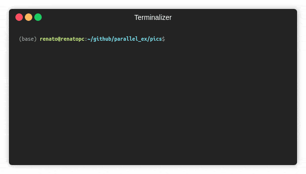

# parallel_ex
Python utility for executing parallel tasks with progress bars for each task.

# Usage:
The function you want to parallelize needs to yield some results:
```python
def some_function(n):
    for i in range(n):
        time.sleep(0.1)
        yield i
```

To execute the same function several times use `ParallelEx.run_n_times`:
```python
from parallel_ex import ParallelEx

def test_run_n_times():
    fun = partial(some_function, 10)
    ParallelEx.run_n_times(fun, n=5, total=10, n_cpu=2)
    # Total specifies the number of expected results.
```



To execute the same function with different arguments use `ParallelEx.run_kwargs`:
```python
def test_run_kwargs():
    totals = [25,8,6,22,12,6,10,9]
    kwargs = [{'n':i} for i in totals]
    ParallelEx.run_kwargs(some_function, kwargs, totals=totals, n_cpu=3)
    # Totals can specify different number of expected results for each execution.
```


